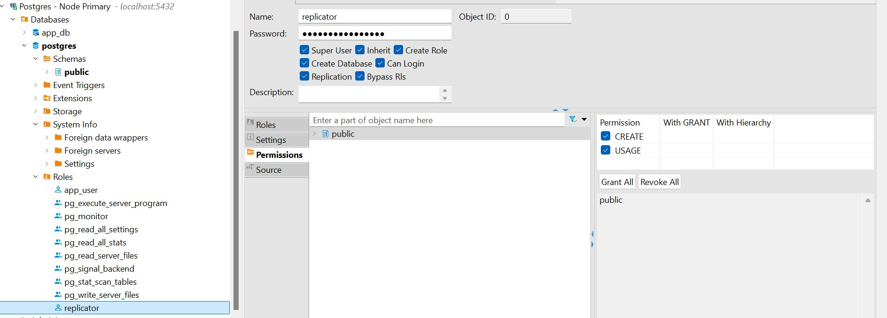
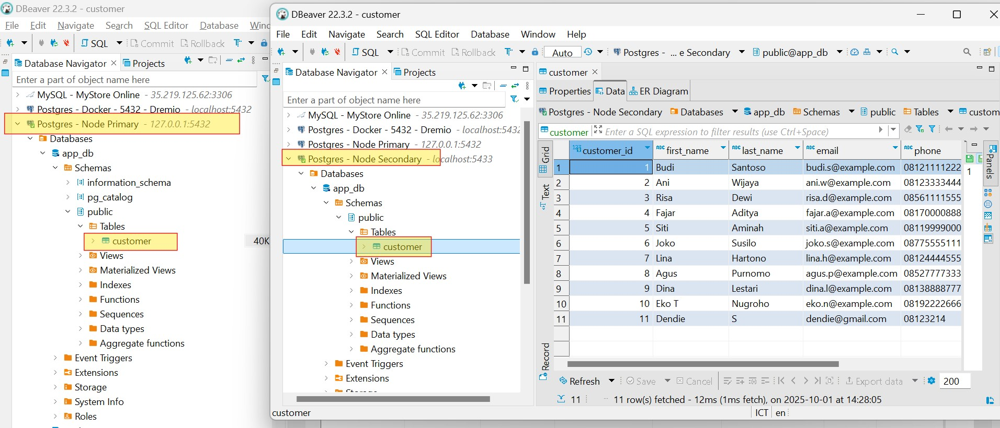

# PostgreSQL Hot Backup Data & Replication 

PostgreSQL Hot Backup Data is a mechanism for keeping a copy of your data live and up-to-date while the main server (Primary Node) is still fully operational. This is achieved through Streaming Replication.

## Table of Contents

1.  **The Core Concept: Replication & Hot Backup**
2.  **Key Mechanism: The WAL Concept**
3.  **When to Use Hot Backup (Replication)**
4.  **Setting Up Replication (PostgreSQL Configuration)**
5.  **How to Promote Node 2 from Secondary to Primary**
6.  **Example Demonstraion Use Docker** 


## 1\. The Core Concept: Replication & Hot Backup

Imagine the **Postgres Node 1 - Primary (5432)** as your **Main Database**. It's the star: the only one accepting all *writes* and *updates* from users (**APPS**).

If this Main Database suddenly **crashes** (*fails*), your entire service stops. This downtime is costly\! To prevent this, we use **Replication**.

  * **Postgres Node 2 - Secondary (5433):** This acts as the **Stuntman Application** . Its job is to **replicate all actions from the Primary in real-time**. This is your **Hot Backup Data**.


## 2\. Key Mechanism: The WAL Concept

Every action in PostgreSQL is recorded.

  * **WAL (Write-Ahead Log):** Think of this as the **Change Script**. Every data change made by the Primary is **logged first** in the WAL.
  * **Auto Replication:** The Secondary Node constantly **streams** and reads this WAL Script from the Primary. It then "replays" every action on its own data, ensuring the two databases are **always identical** and up-to-date.


## 3\. When to Use Hot Backup (Replication)

Use this setup for critical operations:

  * **High Availability (HA):** If the Primary fails, you can initiate a **Failover** (traffic switch). Your service immediately continues running on the Secondary Node with near-zero downtime.
  * **Read Scaling:** You can offload heavy read queries (reports, analytics) to the Secondary Node, reducing the load on the Primary.


## 4\. Setting Up Replication (PostgreSQL Configuration)

To enable WAL streaming from Node 1 (Primary), you must adjust these core settings (requires a server restart):

| Setting | SQL Command | Purpose |
| :--- | :--- | :--- |
| **WAL Quality** | $$\text{ALTER SYSTEM SET wal\_level = 'replica';}$$ | Ensures the WAL contains enough detail for the Secondary to replicate the changes. |
| **Communication Lanes** | $$\text{ALTER SYSTEM SET max\_wal\_senders = '10';}$$ | Sets the maximum number of simultaneous connections allowed for sending WAL data (e.g., to Secondary Nodes). |
| **Security Slot** | $$\text{ALTER SYSTEM SET max\_replication\_slots = '10';}$$ | Ensures the Primary doesn't delete WAL files before the Secondary has copied them, preventing data loss. |
| **Network Access** | $$\text{ALTER SYSTEM SET listen\_addresses = '*';}$$ | Allows the Primary to accept connections from any IP address, including the Secondary Node. |

You also need a **Special Access Key**—a dedicated user (like **`replicator`**) with the **Replication** privilege—for the Secondary Node to securely connect and stream the WAL.



## 5\. How to Promote Node 2 from Secondary to Primary

This is the **Failover** process. Once the old Primary is isolated:

1.  **Switch User:** Access the Secondary server (`pg_replica`) and switch to the **`postgres`** user (the privileged database user).

2.  **Run Promotion Command:** Tell the server to stop standby mode and become the new Primary.

    ```bash
    su - postgres
    postgres@pg-replica:~$ /usr/lib/postgresql/13/bin/pg_ctl -D /var/lib/postgresql/data/ promote
    ```


### Verify the Promotion Status

1. You can confirm using log:


2. You can confirm the change immediately using this SQL query:

```sql
SELECT
    CASE
        WHEN pg_is_in_recovery() THEN 'Standby/Secondary'
        ELSE 'Primary/Master'
    END AS current_role;
```


If the result is **'Primary/Master'**, the promotion is complete, and the database can now accept **write operations**.


## 6\. Example Demonstration Use Docker 

For demonstration replication data, you Just deploy this docker-compose.yaml in docker 

```
 docker-compose up -d
```



